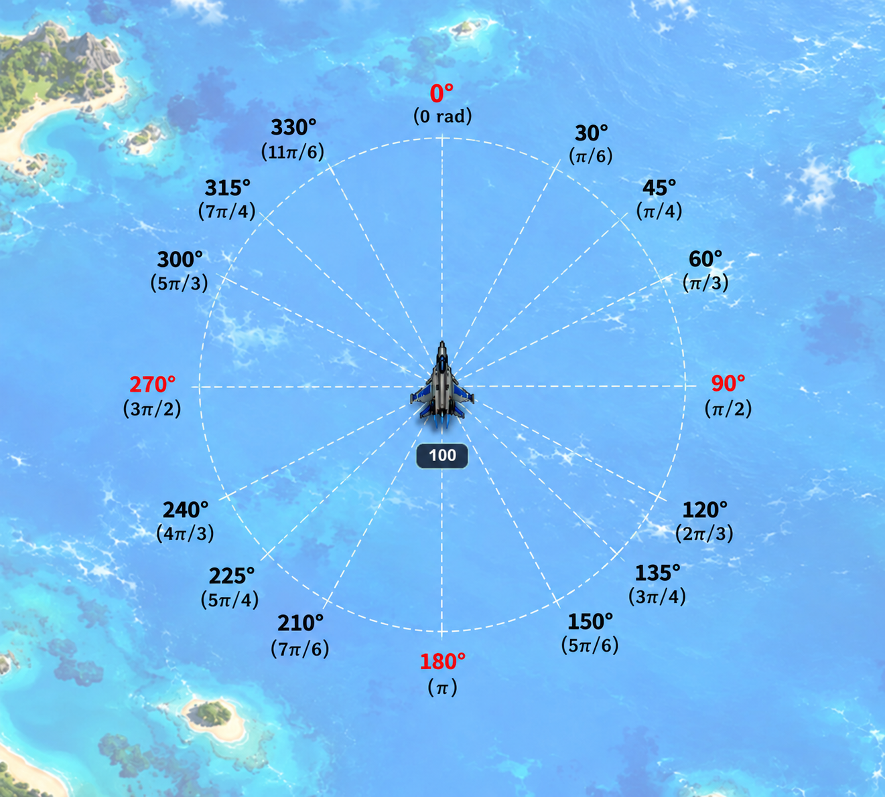

# Batalha de Jatos com Radar

Trabalho desenvolvido para a disciplina de Inteligência Artificial da UFES, campus Alegre.

<p align="center"></p>

O trabalho segue a linha de projetos em Prolog desenvolvidos para a disciplina. Alguns trabalhos anteriores são:


* [Corrida em Prolog](https://github.com/jeiks/corrida_em_prolog) - ([Online](https://www.jeiks.net/corrida_em_prolog/))
* [Batalha de Tanques](https://github.com/jeiks/batalha_tanques) - ([Online](https://www.jeiks.net/batalha_tanques/))
* [Batalha de Jatos](https://github.com/jeiks/prolog_jatos) - ([Online](https://www.jeiks.net/prolog_jatos/))
* [Batalha de OVNIs](https://github.com/jeiks/prolog_ovnis) - ([Online](https://www.jeiks.net/prolog_ovnis/))

Você também pode jogar ele online em: [Jogar Online](https://www.jeiks.net/prolog_jatos_radar/)

O código inicial, ainda da corrida, foi baseado do projeto do [Radu Mariescu-Istodor](https://www.youtube.com/watch?v=NkI9ia2cLhc)<br>
Atualmente, o código dele deve ser somente uma base, a ideia da estrutura. Mas, a inspiração inicial veio do trabalho dele.

Esse trabalho se parece com o [Batalha de Jatos](https://github.com/jeiks/prolog_jatos). Porém, ele não usa sensores como esse outro trabalho e não possui bordas em seu espaço.<br>
Ao invés disso, ele fornece as informações das posições dos outros aviões e também dos mísseis aos agentes, que podem utilizar essas informações como um radar.

### Objetivo

O objetivo é implementar um agente em Prolog capaz de controlar um jato em uma batalha aérea. O agente deve utilizar as informações disponibilizadas pelo jogo para tomar decisões de movimento e disparo e permanecer como o último jato sobrevivente.

Cada jato representa um jogador. Os jogadores podem ser controlados pelo teclado, por regras aleatórias implementadas em JavaScript ou por agentes implementados em Prolog.

## Funcionamento do jogo

Cada jato possui:

* posição `(X,Y)`;
* ângulo de rotação;
* velocidade;
* pontuação/vida (`SCORE`);
* nome;
* tipo de controle.

A arena é **toroidal**. Não existem paredes nas bordas: quando um jato sai por uma extremidade, ele reaparece na extremidade oposta. O mesmo comportamento é utilizado pelos mísseis.

Os jatos podem disparar mísseis. Cada jato pode realizar, no máximo, um disparo por segundo. Os mísseis atravessam as bordas da arena e desaparecem gradualmente até serem desativados.

Atualmente, um jato inicia com `100` pontos de vida. Um impacto de míssil reduz sua vida em `10` pontos. O jogo termina quando apenas um jato permanece com vida maior que zero.

Os jatos podem passar sobre outros jatos sem causar dano entre si.

## Informação fornecida ao agente Prolog

Os antigos sensores laterais foram removidos. O agente recebe uma informação global semelhante a um radar.

A chamada principal do agente é:

```prolog
obter_controles(
    INFORMACAO,
    ADVERSARIOS,
    MISSEIS,
    CONTROLES
).
```

`INFORMACAO` possui:

```prolog
[X,Y,ANGLE,SCORE,SPEED]
```

onde:

* `X`: posição horizontal do jato;
* `Y`: posição vertical do jato;
* `ANGLE`: ângulo do jato em radianos, com `0` apontando para cima;
* `SCORE`: vida atual do jato;
* `SPEED`: velocidade atual.

`ADVERSARIOS` é uma lista com a posição de todos os outros jatos vivos:

```prolog
[[X1,Y1],[X2,Y2],...]
```

`MISSEIS` é uma lista com a posição dos mísseis ativos:

```prolog
[[X1,Y1],[X2,Y2],...]
```

Assim, o agente pode, por exemplo, procurar o adversário mais próximo, identificar um míssil próximo ou escolher uma rota de fuga.

## Controles retornados pelo agente

O predicado `obter_controles/4` deve retornar:

```prolog
[FORWARD,REVERSE,LEFT,RIGHT,BOOM,MSG]
```

onde:

* `FORWARD`: `1` para acelerar e `0` para não acelerar;
* `REVERSE`: `1` para desacelerar e `0` para não desacelerar;
* `LEFT`: `1` para virar para a esquerda e `0` para não virar;
* `RIGHT`: `1` para virar para a direita e `0` para não virar;
* `BOOM`: `1` para tentar disparar e `0` para não disparar;
* `MSG`: mensagem de texto para depuração.

O jogo controla a limitação de um disparo por segundo; portanto, o agente pode retornar `BOOM=1` continuamente sem conseguir disparar mais de uma vez por segundo.

## Configuração do jogo

As principais configurações ficam no início de `main.js`:

```js
const dummyJets=5; // quantidade de jatos aleatórios
const keysJet=true; // jato controlado pelo teclado
const prologJets=[]; // jatos controlados pelo Prolog
```

Para adicionar jatos controlados pelo Prolog, utilize:

```js
prologJets.push("Ligerin");
prologJets.push("Apaga Fogo");
```

A quantidade de elementos em `prologJets` define a quantidade de jatos Prolog criados.

Para não utilizar nenhum jato Prolog, remova/comente as chamadas `prologJets.push(...)` e deixe:

```js
const prologJets=[];
```

Para não utilizar o jato controlado pelo teclado:

```js
const keysJet=false;
```

Para não utilizar jatos aleatórios:

```js
const dummyJets=0;
```

### Atenção

Os arquivos `jato0.pl`, `jato1.pl` etc. correspondem aos agentes Prolog de acordo com o índice atribuído em `prologJetIDs`. Ao adicionar mais jatos Prolog, também é necessário acrescentar o respectivo agente em `jatos_controle.pl` e criar o arquivo correspondente.

## Agentes Prolog

Os exemplos fornecidos implementam regras simples e aleatórias para que o projeto possa ser executado imediatamente.

O primeiro agente é definido em:

```text
jato0.pl
```

e o segundo em:

```text
jato1.pl
```

A interface esperada é sempre:

```prolog
obter_controles([X,Y,ANGLE,SCORE,SPEED], ADVERSARIOS, MISSEIS, [FORWARD,REVERSE,LEFT,RIGHT,BOOM,MSG]) :-
    ...
```

Os arquivos `jatos_controle.pl` e `servidor.pl` fazem a ligação entre o navegador e os agentes Prolog.

## Como executar sem Prolog

Quando não houver jatos controlados pelo Prolog, o jogo pode ser aberto diretamente no navegador de Internet.

Foi testado no navegador Brave.

## Como executar com Prolog

É necessário instalar o SWI-Prolog.

Em distribuições GNU/Linux baseadas em Debian, por exemplo:

```bash
sudo apt install swi-prolog
```

Também é possível obter o SWI-Prolog em:

https://www.swi-prolog.org/

Depois, dentro do diretório do projeto, execute:

```bash
swipl -s servidor.pl
```

O servidor será iniciado automaticamente na porta `8080` e deverá apresentar uma mensagem semelhante a:

```text
--========================================--

% Started server at http://localhost:8080/

--========================================--
```

Com o servidor em execução, acesse:

```text
http://localhost:8080/
```

## Comunicação entre JavaScript e Prolog

O navegador realiza requisições HTTP para:

```text
/action
```

A requisição informa:

```text
id
x
y
angle
score
speed
adversarios
misseis
```

Os vetores `adversarios` e `misseis` são enviados em JSON. O `servidor.pl` converte os valores para números Prolog antes de chamar o agente.

Exemplo conceitual:

```text
adversarios=[[468,380],[489,539],[89,55]]
misseis=[[500,340],[720,350]]
```

A resposta do servidor contém:

```text
forward
reverse
left
right
boom
msg
```

## Mensagens de depuração

O último elemento do vetor de controles é `MSG`.

Exemplo:

```prolog
term_string([ADVERSARIOS,MISSEIS],MSG).
```

Isso pode ser utilizado para enviar ao navegador uma representação textual das informações recebidas pelo agente.

Por exemplo:

```prolog
?- term_string([1,2,"teste",oi],MSG).
MSG = "[1,2,\"teste\",oi]".
```

## Ângulos

O ângulo é fornecido ao agente em radianos.

A referência visual utilizada no jogo considera aproximadamente:

```text
0°   = 0 rad          -> para cima
90°  = PI/2 rad       -> para a direita
180° = PI rad         -> para baixo
270° = 3*PI/2 rad     -> para a esquerda
360° = 2*PI rad       -> novamente para cima
```

A imagem `doc/info.png` apresenta a referência visual utilizada pelo trabalho.

<p align="center"></p>

## Estrutura principal do projeto

```text
.
├── arena.js
├── boom.js
├── colors.js
├── controls.js
├── jet.js
├── main.js
├── servidor.pl
├── jatos_controle.pl
├── jato0.pl
├── jato1.pl
├── utils.js
├── index.html
├── style.css
├── jquery.min.js
├── airplane.png
├── airplane_dummy.png
├── background.jpg
├── favicon.ico
└── doc/
    ├── LEIA-ME.html
    ├── info.png
    └── screenshot.png
```

## Observações

A implementação fornecida é apenas uma base. O objetivo do trabalho é substituir as regras aleatórias dos arquivos `jato0.pl`, `jato1.pl` etc. por estratégias de Inteligência Artificial implementadas em Prolog.

O agente deve utilizar as informações disponíveis para criar estratégias de ataque, fuga, perseguição e sobrevivência.

A atividade também pode ser utilizada em uma competição entre os agentes desenvolvidos pelos alunos.

Boa diversão! :)
